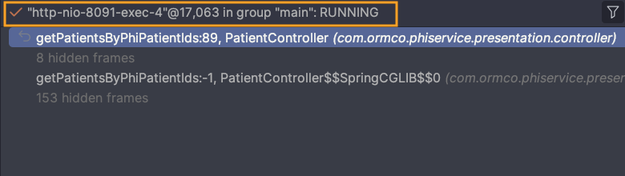
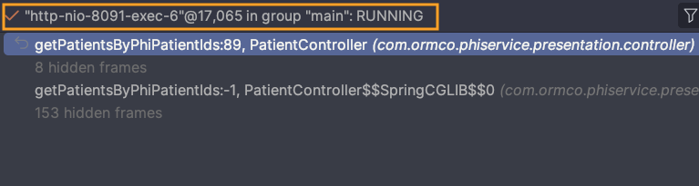

In [part one](../Concurrency - Part 1), we explored how to manage thread pools in Java using `ExecutorService` and how that 
helps you write scalable, concurrent applications. In this post, we look at how Apache Tomcat, a popular Java HTTP 
server, uses thread pools internally to manage concurrent HTTP requests.

## Why Thread Pools Matter in Web Servers

When dealing with HTTP servers, thread pools are crucial for enabling efficient request handling. If a server created a 
brand-new thread for every request, the overhead would be massive — not to mention unstable under load.

Instead, servers like Tomcat use a thread pool, which reuses a fixed number of threads to handle incoming requests 
concurrently.

## Thread Pooling

Tomcat maintains a pool of threads ready to process HTTP requests. When a request arrives:

1. It’s handed off to an available thread from the pool.
2. The request is processed (e.g., your Spring controller runs).
3. The response is sent.
4. The thread is returned to the pool.

This reuse avoids the cost of creating/destroying threads on every request. By reusing threads, Tomcat can 
handle hundreds of concurrent requests while keeping resource usage in check.

## Configuring Thread Pool in Spring Boot

If you’re using Spring Boot with embedded Tomcat, you can configure the thread pool using `application.properties`:

```properties
# Maximum number of worker threads
server.tomcat.max-threads=200

# Minimum number of idle (spare) threads kept alive
server.tomcat.min-spare-threads=10
```

For advanced tuning (like `max-spare-threads`), you can customize it programmatically using a `TomcatConnectorCustomizer`.

## Thread Lifecycle in Tomcat

- On startup, Tomcat creates the number of threads specified by `minSpareThreads`.
- As requests increase, more threads are created (up to `maxThreads`).
- If threads are idle and the number exceeds `maxSpareThreads`, Tomcat starts shutting them down to save memory.

This dynamic scaling keeps your server responsive without over-allocating resources.

## Logging Thread ID in Spring MVC

If you want to see which thread is handling each request in your Spring Boot app, you can implement a 
simple `HandlerInterceptor` like this:

```java
import jakarta.servlet.http.HttpServletRequest;
import jakarta.servlet.http.HttpServletResponse;
import org.slf4j.Logger;
import org.slf4j.LoggerFactory;
import org.springframework.web.servlet.HandlerInterceptor;

public class ThreadLogger implements HandlerInterceptor {

    private static final Logger log = LoggerFactory.getLogger(ThreadLogger.class);

    @Override
    public boolean preHandle(HttpServletRequest request, HttpServletResponse response, Object handler)
        throws Exception {
        log.info("Thread ID preHandle: {}", Thread.currentThread().getId());
        return true;
    }
}
```

When you make requests to the server, your logs might look like this:

```
2025-04-06 10:12:01.124  INFO 22544 --- [http-nio-8080-exec-1] c.e.d.ThreadLogger : Thread ID preHandle: 27
2025-04-06 10:12:01.126  INFO 22544 --- [http-nio-8080-exec-2] c.e.d.ThreadLogger : Thread ID preHandle: 30
2025-04-06 10:12:01.128  INFO 22544 --- [http-nio-8080-exec-3] c.e.d.ThreadLogger : Thread ID preHandle: 35
```

This shows that each HTTP request was picked up by a different worker thread from the pool.

Another way to identify the executing thread is to place a breakpoint in the controller method and then inspect the 
Threads tab in the IDE, as shown below.





## Takeaway

Tomcat does not spawn a thread per request. Instead, it:

- Uses a thread pool to handle requests efficiently
- Allows configuration of concurrency limits
- Scales based on load and resource availability

This architecture is what makes Tomcat suitable for production-scale applications — and it’s another reason why understanding thread pools is essential for backend developers.

---

Happy coding! 💻
